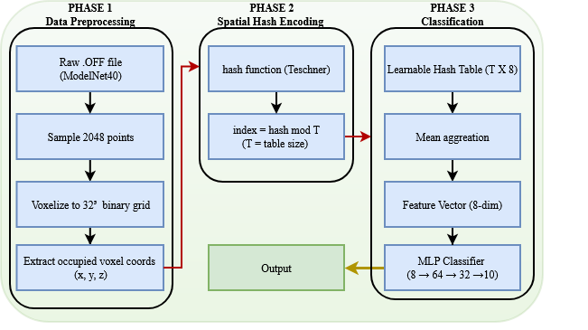
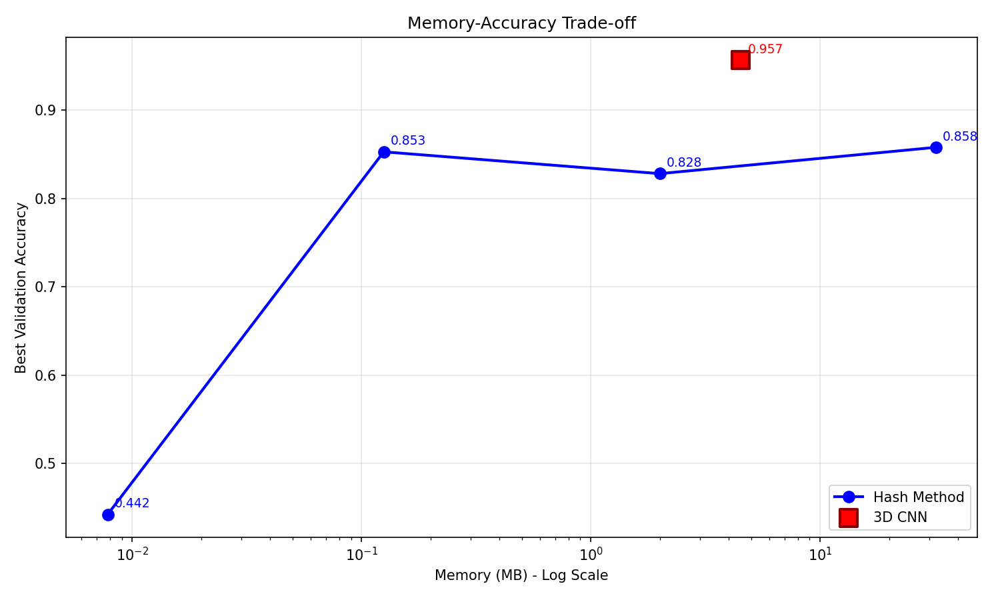
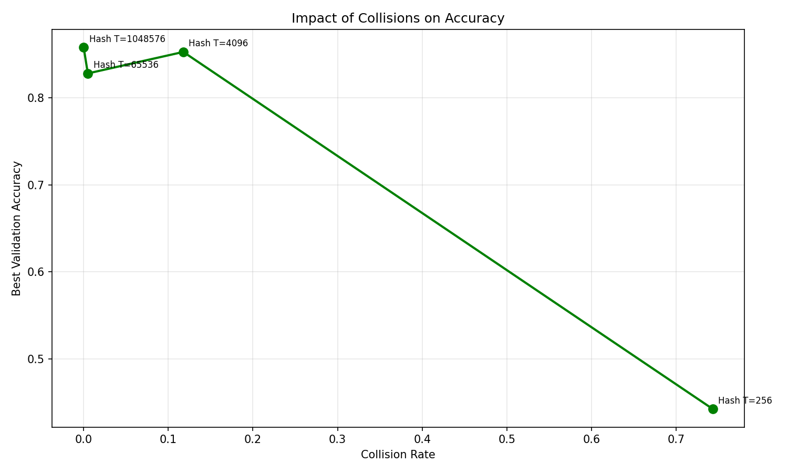
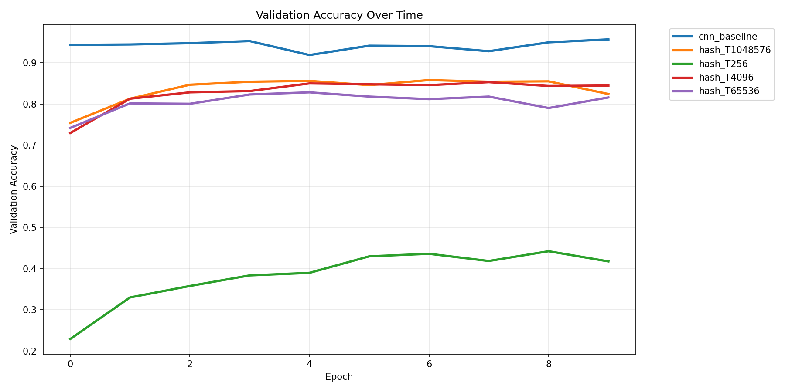

# 3D Point Cloud Classification with Spatial Hashing

A memory-efficient 3D point cloud classifier that replaces dense voxel grids with a single-resolution spatial hash table, enabling real-time 3D perception on memory-constrained edge devices like the NVIDIA Jetson Nano.

## Overview

This project investigates the optimal hash table size for 3D point cloud classification under tight memory budgets. A 32³ binary voxel grid is compressed into a fixed-size 1D hash array, and a lightweight MLP classifies the resulting feature descriptor. The method is benchmarked against an uncompressed 3D CNN baseline on a 10-class subset of ModelNet40, achieving a **37.6× memory reduction** (4.52 MB → 0.12 MB) with only a **10.4% accuracy drop** (95.7% → 85.3%) at the optimal table size **T = 4096**.

---

## Repository Structure

```
3D-pointcloud-spatial-hash-opt/
├── checkpoints/                        # Trained model weights
├── data/
│   ├── processed/                      # Preprocessed point clouds + hash indices
│   └── raw/ModelNet40/                 # Raw .off mesh files (10 classes)
├── reports/
├── figures/
├── src/
│   ├── data/                           # Dataset loading, sampling, voxelization
│   ├── experiments/                    # Hash sweep and plotting scripts
│   ├── models/                         # Hash encoder, MLP, 3D CNN baseline
│   ├── training/                       # Training loops and metric logging
│   └── utils/                          # Config and hash function
├── tests/                              # Unit tests
│   ├── test_cnn.py
│   ├── test_collision.py
│   ├── test_dataset.py
│   └── test_models.py
├── .gitignore
├── LICENSE
├── README.md
├── requirements.txt
└── run_cnn.py
```

---

## Methodology

- **Data**: 10 classes from ModelNet40 (airplane, car, chair, table, sofa, bed, bookshelf, desk, dresser, monitor). Each mesh is sampled to 2048 surface points using `trimesh`, normalized to a unit cube, then discretized into a **32 × 32 × 32 binary voxel grid**.
- **Spatial Hash Encoder**: Only occupied voxels (~2% of the grid) are mapped into a fixed-size 1D array of size `T` via a single-resolution hash function (Teschner et al.) using large primes: `h(x, y, z) = (x·p₁ ⊕ y·p₂ ⊕ z·p₃) mod T`. Hash indices are precomputed on CPU to prevent GPU bottlenecks.
- **Hash Model**: Occupied voxel indices look up 8-dimensional feature vectors, mean-pooled into a global descriptor, then classified by a 2-hidden-layer MLP (64 → 32 neurons, dropout 0.1).
- **3D CNN Baseline**: Three 3D convolutions (16/32/64 channels, 3×3×3 kernels, batch norm, ReLU, 2×2×2 max-pool), flattened to 4096-d, and passed through 3 FC layers — collision-free but memory-heavy.
- **Training**: PyTorch on an NVIDIA RTX 5070, Adam (lr = 0.001, weight decay = 1e-5), batch size 32, 10 epochs, cross-entropy loss.
- **Evaluation**: Hash table size swept logarithmically from T = 2²⁰ down to T = 2⁸. Memory, validation accuracy, and empirical collision rate recorded for each configuration.

---

## Findings and Results

### Memory, Accuracy, and Collision Rate Comparison

| Method                   | Memory (MB) | Accuracy (%) | Collision Rate (%) |
|--------------------------|-------------|--------------|--------------------|
| 3D CNN Baseline          | 4.52        | 95.7         | 0.0                |
| Hash T = 2²⁰ (1,048,576) | 32.00       | 85.8         | 0.0                |
| Hash T = 2¹⁶ (65,536)    | 2.00        | 82.8         | 0.5                |
| **Hash T = 2¹² (4,096)** | **0.12**    | **85.3**     | **11.8**           |
| Hash T = 2⁸ (256)        | 0.01        | 44.2         | 74.3               |

### Key Observations

- **Optimal trade-off at T = 4096**: 37.6× less memory than the CNN with only a 10.4% accuracy drop.
- **Moderate collisions act as a regularizer**: An 11.8% collision rate at T = 4096 is tolerated and slightly outperforms the oversized T = 65,536 model (85.3% vs. 82.8%).
- **Oversized tables waste memory**: T = 1,048,576 uses 32 MB (7× more than CNN) yet only reaches 85.8% accuracy.
- **Collapse threshold**: At T = 256, collision rate spikes to 74.3% — matching the Birthday Problem prediction — and accuracy collapses to near-random (44.2%).

### Figures

| Figure | Description |
|--------|-------------|
|  | Spatial hash model architecture |
|  | Memory vs. accuracy Pareto curve |
|  | Collision rate vs. accuracy |
|  | Validation accuracy over 10 epochs |

Full analysis is available in the [project report](docs/1904469-Esranur-Aygun-ANN-Final-Project-Report.pdf).

---

## How to Reproduce

### 1. Setup

```bash
python -m venv venv
source venv/bin/activate      # Linux/Mac
venv\Scripts\activate         # Windows
pip install -r requirements.txt
```

### 2. Prepare the Data

1. Download ModelNet40 from [Princeton ModelNet](https://modelnet.cs.princeton.edu/).
2. Extract to `data/raw/ModelNet40/` so each class appears as a subdirectory.
3. Run preprocessing:

```bash
python src/data/off_to_pointcloudv2.py
```

This samples 2048 points per mesh, voxelizes into a 32³ binary grid, extracts occupied coordinates, and precomputes hash indices into `data/processed/`.

### 3. Run Experiments

```bash
# Hash table size sweep (T = 256, 4096, 65536, 1048576)
python src/experiments/run_hash_sweep.py

# Dense 3D CNN baseline
python run_cnn.py
```

### 4. Generate Plots

```bash
python src/experiments/plot_results.py
```

Outputs are saved to `experiment_results/`.

---

## Citation

If you use this work, please cite:

```bibtex
@misc{aygun2025spatialhash,
  author       = {Esranur Ayg{\"u}n},
  title        = {Optimal Hash Table Size for 3D Point Cloud Classification},
  year         = {2026},
  howpublished = {\url{https://github.com/fukichime/3D-pointcloud-spatial-hash-opt}},
  note         = {Department of Computer Engineering, Bahçeşehir University}
}
```

---

### Dataset

This project uses ModelNet40. Please cite the original dataset:

```bibtex
@inproceedings{wu20153d,
  author    = {Wu, Zhirong and Song, Shuran and Khosla, Aditya and Yu, Fisher and Zhang, Linguang and Tang, Xiaoou and Xiao, Jianxiong},
  title     = {3D ShapeNets: A Deep Representation for Volumetric Shapes},
  booktitle = {Proceedings of the IEEE Conference on Computer Vision and Pattern Recognition (CVPR)},
  pages     = {1912--1920},
  year      = {2015}
}
```

### Key References

- **Spatial hashing** — Teschner et al., *Optimized Spatial Hashing for Collision Detection of Deformable Objects*, VMV 2003.
- **Multiresolution hash encoding** — Müller et al., *Instant Neural Graphics Primitives with a Multiresolution Hash Encoding*, ACM TOG 2022.
- **Feature hashing theory** — Weinberger et al., *Feature Hashing for Large Scale Multitask Learning*, ICML 2009.
